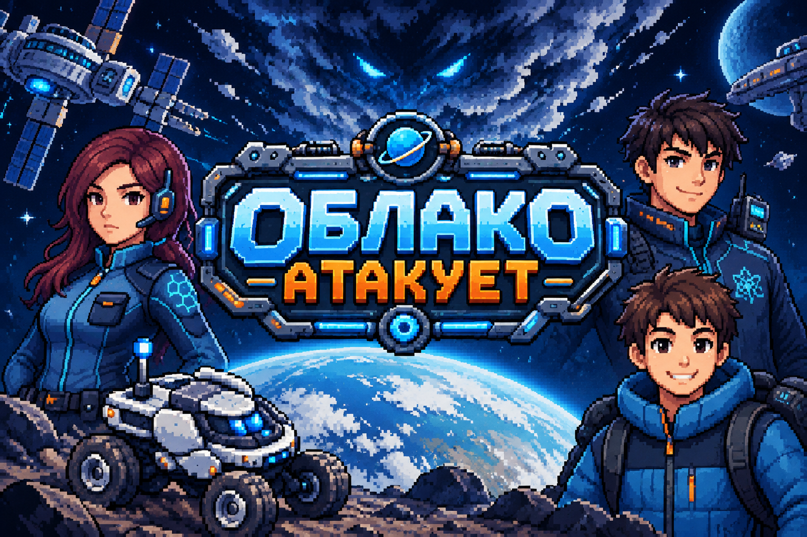

# COSMIX — Облако атакует

**An educational 2D pixel-art adventure about science, robotics, and space exploration.**

**Tutor:** Fedor Gorbachev
**Student:** Kirill
**Educational institution:** KiberOne International Programming School

**Русская версия ниже · English version below**

---

## 🇷🇺 Русская версия

### О проекте

**COSMIX — «Облако атакует»** — образовательная 2D-игра в жанре научно-фантастического приключения, объединяющая исследование окружающей среды, робототехнику, спутниковые технологии и освоение космоса.

Игрок присоединяется к команде юных исследователей, которые изучают необычные природные явления, управляют исследовательскими роверами, анализируют научные данные и решают задачи, требующие логики, планирования и быстрой реакции.

Проект создаётся в рамках обучения программированию в KiberOne International Programming School. Его цель — превратить изучение разработки игр в практический процесс: от программирования игровых механик до построения интерактивных сцен и создания связного повествования.

### Основные направления

* **Разработка игр:** игровые состояния, управление персонажем, интерфейсы и взаимодействие с объектами.
* **Робототехника и автоматизация:** управление роверами, исследование труднодоступных территорий и выполнение научных задач.
* **Наука и экология:** анализ проб, изучение экосистем, мониторинг природных угроз и восстановление окружающей среды.
* **Космические технологии:** спутниковая связь, дистанционное зондирование, радиосигналы и эксперименты на орбите.
* **Геймдизайн:** сюжетные главы, исследовательские задания, мини-игры, испытания на время и альтернативные исходы.

### Сюжет и главы

#### Пролог — «Первое сентября»

Знакомство с игровым миром и базовыми механиками. Игрок управляет первым ровером, анализирует образцы, сталкивается с неожиданным провалом под землю и обнаруживает человека в опасной зоне. После встречи с роем гнуса команда проводит спасательную операцию и связывается с МЧС.

Пролог знакомит игрока с исследовательским оборудованием, управлением ровером и основами взаимодействия с игровым миром.

#### Глава 1 — «Подземные оазисы»

Команда получает задание обследовать загадочную «мёртвую зону». Под землёй обнаруживаются живые оазисы, однако таяние вечной мерзлоты делает систему пещер нестабильной.

**Ключевые задачи:** составить карту подземных полостей, исследовать территорию с помощью роверов и спутника «Зоркий», находить безопасные маршруты.

**Кульминация:** расширяющаяся карстовая воронка угрожает сразу нескольким роверам. Игроку предстоит координировать их перемещение, поддерживать связь и принимать решения в условиях ограниченного времени.

#### Глава 2 — «Рой»

В степях Южной Сибири спутники фиксируют движение гигантского роя саранчи, угрожающего сельскохозяйственным территориям.

**Ключевые задачи:** анализировать спутниковые данные, прогнозировать движение роя и размещать феромонные ловушки в стратегически важных точках.

**Кульминация:** игрок выстраивает цепочку роверов, перенаправляет рой и использует данные дистанционного наблюдения, чтобы не допустить его продвижения к сельскохозяйственным полям.

#### Глава 3 — «Сигнал»

Университетская лаборатория обнаруживает загадочный радиосигнал из Арктики. Он может быть связан с необычным явлением, замеченным ранее в центре управления полётами.

**Ключевые задачи:** определить источник сигнала, использовать спутниковую группировку для триангуляции, отправить роверы в арктическую тундру и адаптировать оборудование к экстремальному холоду.

**Кульминация:** неизвестный источник создаёт радиопомехи. Игроку необходимо выстроить устойчивый канал связи, обходить зоны подавления и сохранить полученные данные.

**Сюжетный поворот:** источник оказывается автономной научной станцией, оставленной около двадцати лет назад. Её системы вышли из-под контроля, а обнаруженные образцы почвы открывают новые вопросы о происхождении необычных явлений.

#### Глава 4 — «Тайга 2.0»

Команда возвращается в «мёртвую зону», чтобы восстановить повреждённую экосистему.

**Ключевые задачи:** подбирать комбинации микроорганизмов и насекомых-санитаров для биоремедиации, изучать влияние различных видов на окружающую среду и поддерживать баланс экосистемы.

**Кульминация:** ускоренное восстановление приводит к неконтролируемому цветению водорослей в подземных водоёмах. Игроку необходимо изменить условия среды и восстановить экологический баланс, прежде чем токсичное цветение уничтожит результаты работы.

Глава делает акцент на взаимосвязи живых организмов, экологических рисках и последствиях вмешательства в природные системы.

#### Глава 5 — «Орбита»

Финал истории переносит команду на новый уровень: университетский проект получает возможность проводить эксперименты на орбитальной станции.

**Ключевые задачи:** подготовить эксперимент с дрозофилами, подобрать условия наблюдения и обеспечить непрерывную связь с орбитальным модулем.

**Кульминация:** неисправность системы микрогравитации приводит к перегреву экспериментальных камер. Игрок управляет ровером-манипулятором с учётом задержки сигнала, восстанавливает охлаждение и пытается сохранить эксперимент.

В финальном испытании необходимо быстро переключить спутниковый канал, синхронизировать связь и получить данные со станции. Результат определяет исход эксперимента и доступную концовку.

### Особенности игрового дизайна

* Исследование нескольких типов локаций: подземные полости, степи, арктическая тундра, тайга и орбитальная станция.
* Задания на сбор и анализ данных.
* Управление исследовательскими роверами и спутниковыми каналами.
* Стратегические испытания, основанные на природных явлениях и технических неисправностях.
* QTE-эпизоды, в которых последовательность действий влияет на результат.
* Сюжетное развитие, связывающее экологию, робототехнику и космические исследования.

### Образовательная ценность

Проект помогает применять навыки программирования на практике и знакомит с тем, как игровые системы объединяют программную логику, визуальные ресурсы, пользовательский ввод и сюжет.

В процессе разработки можно изучать:

* основы Python и Pygame;
* обработку событий и управление игровым циклом;
* проектирование функций и игровых состояний;
* работу с изображениями, анимацией и интерфейсами;
* организацию ресурсов и структуру проекта;
* декомпозицию задач и итеративную разработку.

### Технологии

* **Python**
* **Pygame**
* **Git / GitHub**
* **Pixel art и графические ресурсы**

### Статус проекта

COSMIX развивается как учебный игровой проект для конкурса SkChallenge 2026. Описанные главы и механики отражают концепцию повествования и игрового дизайна; доступность отдельных функций зависит от текущей версии игры.

---

## 🇬🇧 English Version

### About the Project

**COSMIX — The Cloud Attacks** is an educational 2D pixel-art adventure that combines environmental exploration, robotics, satellite technology, and space science.

Players join a team of young researchers investigating unusual natural phenomena, operating scientific rovers, analyzing research data, and solving challenges that require logical thinking, planning, and quick decision-making.

The project is developed as part of programming education at KiberOne International Programming School. Its goal is to turn learning game development into a hands-on experience, covering everything from gameplay logic to interactive scenes and narrative design.

### Core Themes

* **Game Development:** gameplay states, character movement, interfaces, and object interaction.
* **Robotics and Automation:** rover control, remote exploration, and scientific missions.
* **Science and Ecology:** sample analysis, ecosystem research, environmental monitoring, and ecological restoration.
* **Space Technology:** satellite communications, remote sensing, radio signals, and orbital experiments.
* **Game Design:** story-driven chapters, research objectives, mini-games, timed challenges, and alternative outcomes.

### Story and Chapters

#### Prologue — “September First”

The player is introduced to the game world and its core mechanics. After operating the first rover and analyzing a sample, the team encounters a ground collapse and discovers a person in a dangerous area. Following an encounter with a swarm of biting insects, the team carries out a rescue operation and contacts emergency services.

The prologue introduces rover controls, research equipment, and basic interactions with the environment.

#### Chapter 1 — “Underground Oases”

The team is assigned to investigate a mysterious dead zone. Beneath the surface, they discover living oases, but melting permafrost is making the underground cave system increasingly unstable.

**Key objectives:** map underground cavities, explore the area using rovers and the Zorkiy satellite, and identify safe routes.

**Climax:** an expanding sinkhole threatens several rovers at once. The player must coordinate their movements, maintain communications, and make strategic decisions under time pressure.

#### Chapter 2 — “The Swarm”

Satellites detect a massive locust swarm moving across the steppes of Southern Siberia, threatening nearby agricultural areas.

**Key objectives:** analyze satellite data, predict the swarm's trajectory, and deploy pheromone traps at strategically selected locations.

**Climax:** the player establishes a network of rovers, redirects the swarm, and uses remote-sensing data to prevent it from reaching agricultural fields.

#### Chapter 3 — “The Signal”

A university laboratory detects a mysterious radio signal originating in the Arctic. It may be connected to an unusual phenomenon previously observed at a mission control center.

**Key objectives:** locate the signal source, use a satellite constellation for triangulation, deploy rovers across the Arctic tundra, and adapt equipment to extreme cold.

**Climax:** an unknown source generates radio interference. The player must establish a reliable communication route, navigate interference zones, and preserve the collected data.

**Story twist:** the source turns out to be an autonomous research station abandoned approximately twenty years earlier. Its systems have malfunctioned, and unusual soil samples found inside raise new questions about the origin of the phenomena.

#### Chapter 4 — “Taiga 2.0”

The team returns to the dead zone with a new mission: restore the damaged ecosystem.

**Key objectives:** combine microorganisms and decomposer insects for bioremediation, study how different species affect the environment, and maintain ecological balance.

**Climax:** rapid environmental recovery triggers uncontrolled algal blooms in underground reservoirs. The player must adjust environmental conditions and restore the ecosystem's balance before toxic blooms undermine the team's work.

This chapter focuses on ecological interdependence, environmental risks, and the consequences of interventions in natural systems.

#### Chapter 5 — “Orbit”

In the final chapter, the team reaches a new milestone: a university research project is approved for experiments aboard an orbital station.

**Key objectives:** prepare a fruit fly experiment, select appropriate observation conditions, and establish a continuous communication link with the orbital module.

**Climax:** a malfunction in the station's microgravity system causes experimental chambers to overheat. The player operates a robotic rover with delayed controls, restores the backup cooling system, and attempts to save the experiment.

During the final challenge, the player must switch satellite channels, synchronize communications, and retrieve the station's data. The outcome determines the experiment's fate and the available ending.

### Gameplay and Design Highlights

* Multiple environments, including underground caverns, steppes, Arctic tundra, taiga, and an orbital station.
* Research missions focused on collecting and analyzing data.
* Scientific rover control and satellite communication management.
* Strategic encounters built around environmental hazards and technical failures.
* Quick-time events in which action sequences influence mission outcomes.
* A connected narrative bringing together ecology, robotics, and space exploration.

### Educational Value

The project provides a practical way to apply programming skills and explore how software logic, visual assets, user input, and narrative design work together in an interactive experience.

Development topics include:

* Python and Pygame fundamentals;
* event handling and game loops;
* functions and game-state management;
* image rendering, animation, and interfaces;
* asset organization and project structure;
* task decomposition and iterative development.

### Technology Stack

* **Python**
* **Pygame**
* **Git / GitHub**
* **Pixel art and visual assets**

### Project Status

COSMIX is an evolving educational game development project for hackathon SkChallenge 2026. The chapters and gameplay mechanics described above represent the narrative and design concept; individual features may still be under development.
